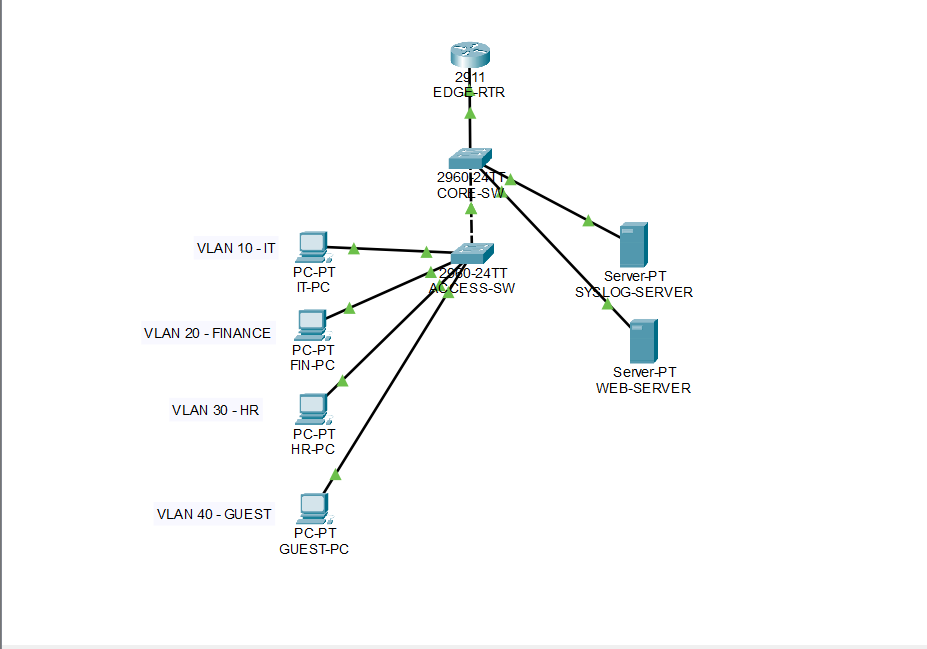
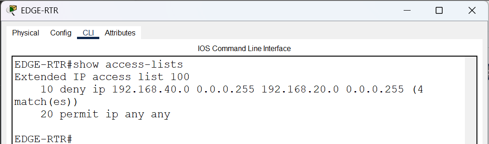
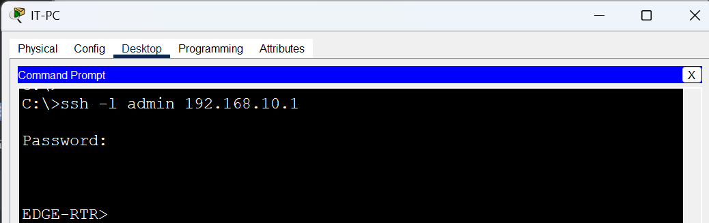
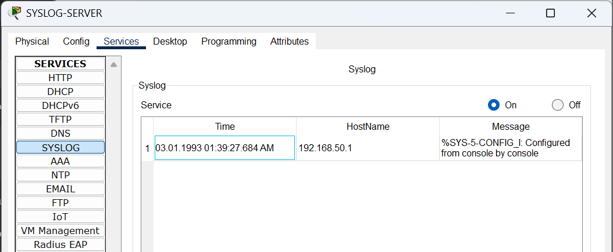
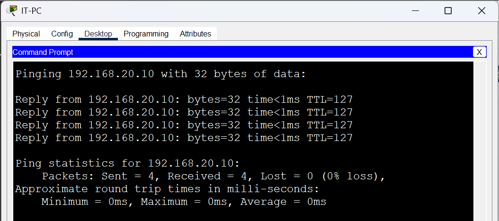
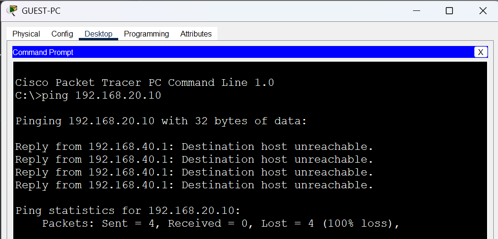

# Enterprise Network Security Infrastructure

A simulated secure banking network implemented using Cisco Packet Tracer.  
This project demonstrates practical enterprise network security concepts including VLAN segmentation, ACL enforcement, SSH secure administration, Syslog monitoring, and attack simulation.

---

## Project Overview

The network was designed to simulate a secure enterprise banking infrastructure with multiple departments separated using VLANs and protected through access control mechanisms.

The project includes:

- VLAN Segmentation
- Router-on-a-Stick Configuration
- Access Control Lists (ACLs)
- SSH Secure Remote Administration
- Syslog Monitoring
- Internal Web Server Access Control
- Security Validation & Attack Simulation

---

## Technologies Used

- Cisco Packet Tracer
- VLANs
- ACLs
- SSH Version 2
- Syslog Services
- Router-on-a-Stick

---

## Network Topology

---

## ACL Enforcement

Blocked access from unauthorized VLANs using extended ACL rules.

---

## Secure SSH Administration

Remote management secured using SSH Version 2 authentication.

---

## Syslog Monitoring

Centralized log monitoring configured using a Syslog Server.

---

## Authorized Access Validation

Authorized users successfully accessed internal resources.

---

## Unauthorized Access Prevention

Unauthorized guest access was successfully blocked.

---

## Project Files

- Packet Tracer topology
- Technical report
- Security screenshots
- Presentation slides

---

## Author

Saad Almutairi  
Cybersecurity Diploma Student  
Imam Mohammad Ibn Saud Islamic University
